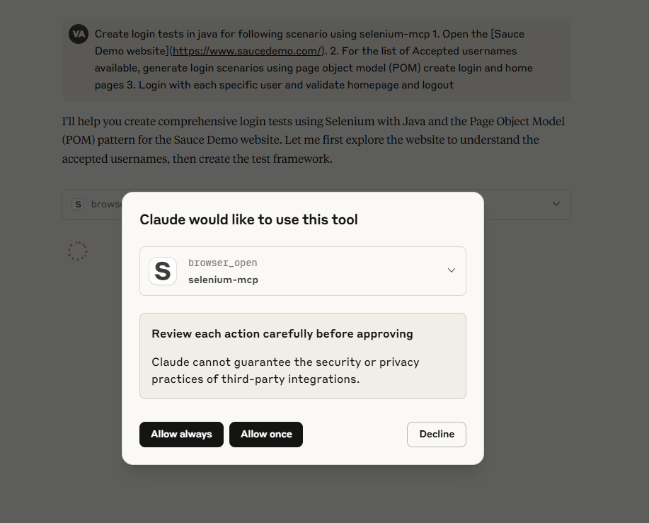

# Selenium MCP Server

[](https://smithery.ai/server/@pshivapr/selenium-mcp)

A Model Context Protocol (MCP) server for [Selenium](https://www.selenium.dev/) that provides comprehensive Selenium WebDriver automation tools for AI assistants and applications. This server enables automated web browser interactions, testing, and scraping through a standardized interface.

[](https://glama.ai/mcp/servers/@pshivapr/selenium-mcp)

[](https://lobehub.com/mcp/pshivapr-selenium-mcp)

## 🚀 Overview

This is a server implementation that bridges the gap between MCP clients (AI assistants) and Selenium WebDriver. It exposes Selenium WebDriver's functionalities as MCP tools, allowing AI models to utilize them for tasks like:

- Browser management (launching, navigating, closing browsers)
- Element interaction (clicking, typing, finding elements)
- Web scraping and automated testing
- Advanced operations like screenshots, cookie management, and JavaScript execution

Built with TypeScript and modern ES modules, it offers type-safe browser automation capabilities through the Model Context Protocol.

## ✨ Key Features

- **Multi-Browser Support**: Chrome, Firefox, Safari, and Edge browser automation
- **Comprehensive Element Interaction**: Click, type, hover, drag & drop, file uploads
- **Advanced Navigation**: Forward, backward, refresh, window management
- **Wait Strategies**: Intelligent waiting for elements and page states
- **Type Safety**: Full TypeScript implementation with Zod validation

## 🤝 Integration

### MCP Client Integration

Configure your MCP client to connect to the Selenium server:

### Standard Configuration (applicable to Windsurf, Warp, Gemini CLI etc)

```json
{
  "servers": {
    "Selenium": {
      "command": "npx",
      "args": ["-y", "selenium-webdriver-mcp"]
    }
  }
}
```

## Installation in VS Code

Update your `mcp.json` in **VS Code** with below configuration

**NOTE**: If you're new to MCP servers, follow this link [Use MCP servers in VS Code](https://code.visualstudio.com/docs/copilot/chat/mcp-servers)

### Example 'stdio' type connection

```json
{
  "servers": {
    "Selenium": {
      "command": "npx",
      "args": [
        "-y",
        "selenium-webdriver-mcp"
      ],
      "type": "stdio"
    }
  },
  "inputs": []
}

```

### Example 'http' type connection

```json
{
  "servers": {
    "Selenium": {
      "url": "https://smithery.ai/server/@pshivapr/selenium-mcp",
      "type": "http"
    }
  },
  "inputs": []
}

```

After installation, the Selenium MCP server will be available for use with your GitHub Copilot agent in VS Code.

### To install the Selenium MCP server using the VS Code CLI

```bash
# For VS Code
code --add-mcp '{\"name\":\"Selenium\",\"command\": \"npx\",\"args\": [\"selenium-webdriver-mcp\"]}'

```

```bash
# For VS Code Insiders
vscode-insiders --add-mcp '{\"name\":\"Selenium\",\"command\": \"npx\",\"args\": [\"selenium-webdriver-mcp\"]}'
```

## To install the package using either npm, or Smithery

Using npm:

```bash
npm install -g selenium-webdriver-mcp
```

Using [Smithery](https://smithery.ai/server/@pshivapr/selenium-mcp)

To install Selenium MCP for Claude Desktop automatically via [](https://smithery.ai/server/@pshivapr/selenium-mcp)

```bash
npx @smithery/cli install @pshivapr/selenium-mcp --client claude
```

## Claude Desktop Integration

Add to your Claude Desktop configuration:

```json
{
  "mcpServers": {
    "Selenium": {
      "command": "npx",
      "args": ["-y", "selenium-webdriver-mcp"]
    }
  }
}
```

## Screenshot



## 🛠️ MCP Available Tools

### Browser Management Tools

| Tool | Description | Parameters |
|------|-------------|------------|
| `browser_open` | Open a new browser session | `browser`, `options` |
| `browser_navigate` | Navigate to a URL | `url` |
| `browser_navigate_back` | Navigate back in history | None |
| `browser_navigate_forward` | Navigate forward in history | None |
| `browser_title` | Get the current page title | None |
| `browser_refresh` | Refresh the current page | None |
| `browser_get_url` | Get the current page URL | None |
| `browser_get_page_source` | Get the current page HTML source | None |
| `browser_maximize` | Maximize the browser window | None |
| `browser_resize` | Resize browser window | `width`, `height` |
| `browser_close` | Close current browser session | None |

### Cookie Management Tools

| Tool | Description | Parameters |
|------|-------------|------------|
| `browser_get_cookies` | Get all cookies from the current browser session | None |
| `browser_get_cookie_by_name` | Get a specific cookie by name | `cookie` (cookie name) |
| `browser_add_cookie_by_name` | Add a new cookie to the browser | `cookie` (cookie name), `value` |
| `browser_set_cookie_object` | Set a cookie object in the browser | `cookie` (cookie object as string) |
| `browser_delete_cookie` | Delete a specific cookie by name | `value` (cookie name to delete) |
| `browser_delete_cookies` | Delete all cookies from the current browser session | None |

### Window Management Tools

| Tool | Description | Parameters |
|------|-------------|------------|
| `browser_switch_to_window` | Switch to a different browser window by handle | `windowHandle` |
| `browser_switch_to_original_window` | Switch back to the original browser window | None |
| `browser_switch_to_window_by_title` | Switch to a window by its page title | `title` |
| `browser_switch_window_by_index` | Switch to a window by its index position | `index` |
| `browser_switch_to_window_by_url` | Switch to a window by its URL | `url` |

### Element Interaction Tools

| Tool | Description | Parameters |
|------|-------------|------------|
| `browser_find_element` | Find an element on the page | `by`, `value`, `timeout` |
| `browser_find_elements` | Find multiple elements on the page | `by`, `value`, `timeout` |
| `browser_click` | Click on an element | `by`, `value`, `timeout` |
| `browser_type` | Type text into an element | `by`, `value`, `text`, `timeout` |
| `browser_get_element_text` | Get text content of element | `by`, `value`, `timeout` |
| `browser_file_upload` | Upload file via input element | `by`, `value`, `filePath`, `timeout` |
| `browser_clear` | Clear text from an element | `by`, `value`, `timeout` |
| `browser_get_attribute` | Get element attribute value | `by`, `value`, `attribute`, `timeout` |

### Element State Validation Tools

| Tool | Description | Parameters |
|------|-------------|------------|
| `browser_element_is_displayed` | Check if an element is visible on the page | `by`, `value`, `timeout` |
| `browser_element_is_enabled` | Check if an element is enabled for interaction | `by`, `value`, `timeout` |
| `browser_element_is_selected` | Check if an element is selected (checkboxes, radio buttons) | `by`, `value`, `timeout` |

### Frame Management Tools

| Tool | Description | Parameters |
|------|-------------|------------|
| `browser_switch_to_frame` | Switch to an iframe element | `by`, `value`, `timeout` |
| `browser_switch_to_parent_frame` | Switch to the parent frame (from nested iframe) | None |
| `browser_switch_to_default_content` | Switch back to the main page content | None |

### Advanced Action Tools  

| Tool | Description | Parameters |
|------|-------------|------------|
| `browser_hover` | Hover over an element | `by`, `value`, `timeout` |
| `browser_double_click` | Double-click on an element | `by`, `value`, `timeout` |
| `browser_right_click` | Right-click (context menu) | `by`, `value`, `timeout` |
| `browser_drag_and_drop` | Drag from source to target | `by`, `value`, `targetBy`, `targetValue`, `timeout` |
| `browser_wait_for_element` | Wait for element to appear | `by`, `value`, `timeout` |
| `browser_execute_script` | Execute JavaScript code | `script`, `args` |
| `browser_screenshot` | Take a screenshot | `filename` (optional) |
| `browser_select_dropdown_by_text` | Select dropdown option by visible text | `by`, `value`, `text`, `timeout` |
| `browser_select_dropdown_by_value` | Select dropdown option by value | `by`, `value`, `dropdownValue`, `timeout` |
| `browser_key_press` | Press a keyboard key in the browser | `key`, `timeout` |

### Scrolling Tools

| Tool | Description | Parameters |
|------|-------------|------------|
| `browser_scroll_to_element` | Scroll to bring an element into view | `by`, `value`, `timeout` |
| `browser_scroll_to_top` | Scroll to the top of the page | None |
| `browser_scroll_to_bottom` | Scroll to the bottom of the page | None |
| `browser_scroll_to_coordinates` | Scroll to specific coordinates | `x`, `y` |
| `browser_scroll_by_pixels` | Scroll by specified number of pixels | `x`, `y` |

### Form Interaction Tools

| Tool | Description | Parameters |
|------|-------------|------------|
| `browser_select_checkbox` | Select/check a checkbox | `by`, `value`, `timeout` |
| `browser_unselect_checkbox` | Unselect/uncheck a checkbox | `by`, `value`, `timeout` |
| `browser_submit_form` | Submit a form element | `by`, `value`, `timeout` |
| `browser_focus_element` | Focus on a specific element | `by`, `value`, `timeout` |
| `browser_blur_element` | Remove focus from a specific element | `by`, `value`, `timeout` |

### Element Locator Strategies

- **`id`**: Find by element ID
- **`css`**: Find by CSS selector
- **`xpath`**: Find by XPath expression
- **`name`**: Find by name attribute
- **`tag`**: Find by HTML tag name
- **`class`**: Find by CSS class name

## 📋 Requirements

- **Node.js**: Version 18.0.0 or higher
- **Browsers**: Chrome, Firefox, Safari, or Edge installed
- **WebDrivers**: Automatically managed by selenium-webdriver
- **Operating System**: Windows, macOS, or Linux

## 🚦 Development

### Getting Started

1. **Clone the repository**:

   ```bash
   git clone https://github.com/pshivapr/selenium-mcp.git
   cd selenium-mcp
   ```

2. **Install dependencies**:

   ```bash
   npm install
   ```

3. **Build the project**:

   ```bash
   npm run build
   ```

### Running the Server

#### Production Mode

```bash
npm start
```

#### Development Mode (with auto-reload)

```bash
npm run dev
```

#### Direct Execution

```bash
node dist/index.js
```

### Using as CLI Tool

After building, you can use the server as a global command:

```bash
npx selenium-webdriver-mcp
```

## 📝 License

MIT License - see LICENSE file for details.

## 🤝 Contributing

Contributions are welcome! Please feel free to submit a Pull Request.

1. Fork the repository
2. Create your feature branch (`git checkout -b feature/AmazingFeature`)
3. Commit your changes (`git commit -m 'Add some AmazingFeature'`)
4. Push to the branch (`git push origin feature/AmazingFeature`)
5. Open a Pull Request

## 📊 Version History

- **0.2.3** - Selenium MCP Server
  - Multi-browser support (Chrome, Firefox, Safari, Edge)
  - Complete element interaction toolset
  - Advanced action capabilities
  - Type-safe TypeScript implementation
  - MCP protocol compliance

## Badges/Mentions

[MCP Market](https://mcpmarket.com/server/selenium-4)

[Pulse](https://www.pulsemcp.com/servers/pshivapr-selenium-webdriver)

[](https://lobehub.com/mcp/pshivapr-selenium-mcp)

---

## Built with ❤️ for the Model Context Protocol ecosystem
